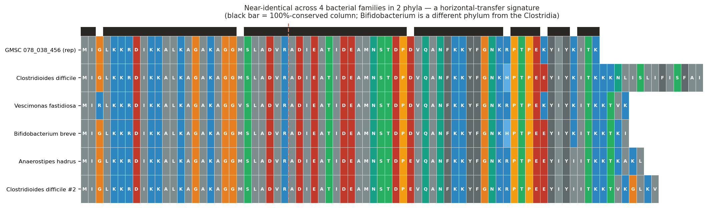

# MIMIC

**▶ [Live interactive deck](https://kenloi.github.io/mimic-gut-secretome/)** — click through the 11-slide demo; slide 6 has a manipulable 3D structure of MIMIC on IL7R.


**A mobile microbial peptide that engages a human cytokine receptor.**

*A structure-first screen of the gut secretome against human immune receptors.*

**Kenneth Loi, Zhaojun Wang** · Built with Claude Science

---

## Summary

The human gut encodes a hundred times more microbial genes than human genes — the body's largest reservoir of coding potential. We have spent a decade reading its output as *chemistry*: short-chain fatty acids, bile acids, tryptophan metabolites, each mapped to a human receptor. Whether commensals also signal in *protein* — secreted miniproteins that engage our receptors directly — is essentially unknown. We built a structure-first screen to ask, co-folding ~2,000 gut-secreted miniprotein families against a panel of human immune receptors and sequence-matched decoys, scoring each interface against a null.

Here we report **MIMIC**, a **M**obile **I**mmuno**M**odulatory **I**CE-borne **C**ommensal peptide. Two features distinguish it. First, it folds a confident interface on **IL7R** and lands on the exact surface where interleukin-7 binds (65% overlap), with no sequence homology to IL-7 — a structural mimic, not a captured gene. Second, it is not fixed to one genome: MIMIC rides a conjugative element traded across four bacterial families in two phyla, including the pathogen *Clostridioides difficile* (enrichment p = 0.003).

One peptide is a lead. The finding behind it is larger. The microbiome may be a mobile library of human-receptor ligands — disease-linked, tradeable between species, and almost entirely uncharted. This is an axis of microbe–host communication we have barely begun to read.

---

## Design

The unit of observation is a **peptide–human-protein pair**, scored by ESMFold2-Fast
interface confidence. Never a peptide in isolation, and never a claim of causation — the
output is a ranked list of structurally-supported candidate interactions.

### Peptide set — from a billion smORFs to ~2,000 families
We began from the Global Microbial smORF Catalog (GMSC; ~965M smORFs across 75 habitats,
annotated by taxonomy, habitat, quality, and predicted localization).

1. **Habitat + secretion + quality filter.** Restrict to `human gut` habitat, predicted
   secreted (SignalP-positive) or transmembrane, and the high-quality set. → ~100,098
   sequences.
2. **Collapse to family representatives.** Deduplicate to family reps (GMSC 90%-identity
   families); intersect with the released, gut-only set. → **2,187 gut-secreted
   high-quality miniprotein families** as the core screen set.

The peptide is the unit; a family representative stands for its family. Genomic context
(recovered from DIAMOND/MMseqs homolog loci) is used downstream as a *prioritization
axis*, not a pre-filter — see "Locus context as an axis" below.

### Receptor panel — 15 receptors, frozen
The human target panel was curated by a collaborator (Zhaojun Wang) and **frozen before
any structure prediction** — an immutable 15-receptor panel, so no target is chosen after
seeing a score. Selection combined four live-verified evidence sources: **UniProt**
(sequence, ectodomain/TM topology, signal peptide), **Open Targets Platform v4** (IBD /
Crohn / UC / CRC association scores), **Human Protein Atlas 25.1** (single-cell gut/immune
expression), and **IUPHAR/Guide to Pharmacology** (endogenous ligand identity/type). Each
receptor carries a **gate** (folding suitability) and an **embedding-suitability** flag
(is the endogenous ligand a peptide, so a mimic is even plausible?). No low-gate receptor
was kept. Categories: cytokine receptors (IL7R, IL6R, IL10RA, IL23R, TNFRSF1B),
chemoattractant / class-A GPCRs (FPR1, FPR2, CCR6, CXCR4, GPR35, GLP1R), pattern /
barrier / adhesion (TLR2, EGFR, ITGA4, ITGB7). The ectodomain (not the full-length
receptor) was folded where the ligand engages the ECD.

### Decoys and the null — how a "hit" is defined
A high iPTM means nothing without a null. We added **10 decoy receptors** — structurally
comparable human receptors *outside* the immune-signaling hypothesis (INSR, EPOR, GHR,
LGR4, GCGR, PTHR1, ADRB2, DRD2, ITGAV, ITGB3), several of them groove-bearing folds so
the decoy set is a hard specificity test, not just housekeeping enzymes. Every peptide is
folded against all **25 targets (15 + 10)**. A pair's interface confidence is converted to
a **decoy-calibrated z-score** against that peptide's own decoy distribution. The gate is
`iPTM ≥ 0.5, interface PAE ≤ 15 Å, z ≥ 3` — a hit must beat its own null, not merely score
well. (Shuffled-sequence decoy peptides for a global empirical FDR are the planned Stage-2
extension.)

## The correction that changed the lead

The initial screen nominated five Tier-A families and a lead (281_962_460 × TLR2,
iPTM 0.91). A provenance audit found **four methodological errors**; correcting them
changed the lead entirely. This audit is the methodological spine of the project.

**Error 1 — precursor folding inflated the interface.** The screen had folded the full
**precursor**, signal peptide included — not the **mature** secreted form that actually
leaves the cell. Secreted bacterial peptides are cleaved on export; the signal peptide is
not present in the molecule a host receptor would meet. We predicted signal peptides
(SignalP 5.0b, gram±), derived mature sequences for 297 families, and **refolded 7,408
structures (297 × 25) in a single session**, zero missing after OOM recovery. Removing the
signal peptide **collapsed 4 of 5 Tier-A hits** — the old hero's TLR2 interface fell from
iPTM 0.91 to 0.40, an almost entirely signal-peptide artifact. Only one legacy hit
(277_230_793 × IL7R) survived maturation.

**Error 2 — expression evidence was unused.** Ranking used structure only. We added
metaproteomic (metaP) and metatranscriptomic (metaT) detection as an axis; a family is
"expressed" when metaP > 0 (protein-level detection). The old hero has metaP = 0.00; the
new lead has metaP = 0.64. Expression inverts the ranking.

**Error 3 — signaling-adjacent families were wrongly excluded.** 282 families had been set
aside for carrying a bacterial-signaling annotation (RRNPP / quorum-sensing /
two-component context) in their neighborhood, on the assumption that a bacterial cognate
disqualifies a host-directed role. But a peptide can be dual-function. We folded them
rather than excluding them, and reframed locus context as an **axis, not a filter**:
families are **orphan** (no cognate receptor nearby — "must be talking to something else")
or **cognate-bearing**. Of 297 folded families, 134 are orphans, 163 carry a cognate;
35 dual-context candidates (human-receptor hit + bacterial cognate) were surfaced as the
direct test of the dual-function hypothesis.

**Error 4 — binding-site accessibility was unchecked.** A high iPTM was taken at face
value without asking whether the docked surface is physically available in the biological
assembly. For the top candidates we compared the predicted footprint to the surface buried
by the native partner in an experimental complex (ΔSASA, Shrake–Rupley; 3DI2 IL7R·IL-7,
1J7V IL10RA·IL-10, 3ALQ TNFR2·TNF, 5MZV IL23R·IL-23, 3V4P α4β7, 8H8J GPR35·G-protein). Of
the top 12, 7 dock accessible surfaces; 3 were down-weighted as occluded — two integrin
hits target the obligate α4/β7 interface, one GPCR hit targets the intracellular
G-protein face, both unreachable by a secreted extracellular peptide.

### Locus context as an axis
Final ranking order, most-interesting first: **(1) orphan + human-receptor hit +
expressed** (secreted, no local cognate, folds on a human receptor, protein-detected — the
hero class), then **(2) cognate-bearing + hit + expressed** (dual-function candidate). The
reranked actionable set is 59 Tier-A/B pairs; the full 297-family table is in `results/`.

### What did not change
Engine (ESMFold2-Fast), the frozen 15+10 panel, and the decoy-calibrated gate
(iPTM ≥ 0.5, PAE ≤ 15, z ≥ 3) are unchanged through the correction. No datasets or targets
were added — the correction re-used the frozen panel and the existing GMSC family set. The
screen remains hypothesis prioritization, not causation.

## Results — the reranked leads

The corrected screen yields 59 actionable pairs. The top of the orphan +
hit + expressed class:

| Rank | Family | Receptor | iPTM | PAE (Å) | z | metaP | Locus | Site | Accessible |
|---|---|---|---|---|---|---|---|---|---|
| 1 | 078_038_456 | IL7R | 0.91 | 7.4 | 6.0 | 0.64 | orphan | ligand-competitive | PASS |
| 2 | 283_075_895 | IL7R | 0.81 | 11.9 | 4.9 | 0.22 | orphan | novel-epitope | PASS |
| 3 | 269_289_576 | TNFRSF1B | 0.80 | 13.4 | 6.6 | 0.19 | orphan | novel-epitope | PASS |
| 4 | 268_980_410 | IL10RA | 0.74 | 12.1 | 10.0 | 0.14 | orphan | novel-epitope | PASS |
| 5 | 268_961_644 | IL7R | 0.66 | 13.0 | 4.7 | 0.60 | orphan | ligand-competitive | PASS |
| 6 | 093_326_021 | ITGB7 | 0.82 | 19.2 | 7.9 | 0.95 | orphan | ligand-competitive | FAIL |
| 7 | 135_351_865 | ITGA4 | 0.75 | 20.9 | 7.0 | 0.25 | orphan | ligand-competitive | FAIL |
| 8 | 246_552_641 | TLR2 | 0.67 | 18.6 | 15.4 | 0.26 | orphan | partial | untestable |

*Full table: [`results/reranked_candidate_table.tsv`](results/reranked_candidate_table.tsv) (59 pairs, all axes) and `reranked_candidates_full.tsv` (all 297).* The pattern is striking: the strongest orphan-expressed hits cluster on IL7R and related cytokine receptors, and the single best candidate on every corrected axis is **078_038_456 × IL7R**.

### A structural mimic, not a sequence mimic
For each top candidate we ran local Smith–Waterman alignment (BLOSUM62) against the
receptor's native ligand and against the viral mimics that engage the same receptors
(EBV/CMV vIL-10, KSHV vIL-6, KSHV vMIP-II), calibrated against a 200-iteration
shuffled-sequence null. **No candidate shows sequence similarity above chance** (all
z < 1.2; best 094 × IL-7, z = 1.14, n.s.). This is informative, not disappointing: if these
interfaces are real, the peptides are **structural mimics** that present a compatible
surface without descending from the ligand. A BLAST/homology screen would have missed
them entirely — only a structure screen finds them, and this is precisely the class of
signal the viral (sequence-homologous) mimics are *not*.

## MIMIC engages the IL-7 binding site

The lead docks the cytokine-binding face of IL7R. Superposed on the IL-7·IL7R crystal (PDB 3DI2), the predicted receptor matches the native structure to 0.6 Å Cα RMSD, and 96% of the peptide backbone lies within 8 Å of the native IL-7 footprint — a 65% overlap of contact residues. The epitope coincides with a cluster of IL7R variants annotated to severe combined immunodeficiency (SCID). MIMIC carries **no** sequence homology to IL-7: this is structural mimicry, independently evolved.


## MIMIC is horizontally mobile

The peptide's genomic neighborhood is not metabolic — it is a mobile genetic element. Across five recovered genomes, four carry the peptide inside conserved conjugation machinery: a MobT relaxase, a Tcp-family conjugation ATPase, ArdA antirestriction, and a tyrosine recombinase/integrase — the signature of an Integrative and Conjugative Element (ICE). Against a genome-wide null of 592 gut smORF families, MIMIC's neighborhood is the 2nd-most mobile-element-associated (31% vs 2% background; permutation **p = 0.003**). No cognate bacterial receptor is conserved in the neighborhood — the peptide is an orphan signal.


The homologs span four families in two phyla — *Clostridioides difficile*, *Vescimonas fastidiosa*, *Anaerostipes hadrus* (Bacillota), and *Bifidobacterium breve* (Actinomycetota). A ~94%-identical peptide shared between Clostridia and Bifidobacterium is not vertical inheritance; it is the signature of recent horizontal transfer.



## The hypothesis: an immune-shielding peptide

We propose MIMIC is an **anti-inflammatory / immune-shielding** peptide. Its geometry is
ligand-competitive — it occupies the IL-7 binding site — which predicts an **IL-7
antagonist**: by blunting IL-7-driven lymphocyte survival and expansion, it would dampen
the host's ability to mount a sustained response against the microbe that displays it. IL-7
is not a pro-inflammatory cytokine; it is a lymphocyte homeostasis signal, so *lowering* it
is a plausible route to immune invisibility, not to inflammation.

This reframes the conservation pattern. The same cassette in benign commensals *and* in
*C. difficile* is not a coincidence — the selected trait is **immune shielding**, useful to
any gut resident, and the conjugative element spreads it. In a commensal it buys quiet
coexistence; carried by the mobile element into a pathogen, the same shield aids
persistence against host defenses. One trait, one vehicle, two consequences.

This is a hypothesis motivated by structure and genomics, not a demonstrated mechanism.
The assay below is designed to confirm or kill it.

## Why this matters

Three implications follow, each stated with its hedge.

**A new class of signal.** Known microbe→immune-system signals run through metabolites
(short-chain fatty acids, bile acids) or conserved molecular patterns sensed by
pattern-recognition receptors (LPS→TLR4). A secreted microbial *protein* that docks a
human *cytokine receptor at its ligand site* is a different category. If functional,
MIMIC would be the first example of a microbial peptide directly modulating a human
immune receptor by ligand mimicry.

**A mobile trait.** MIMIC rides a conjugative element — the ICE is the vehicle, the
peptide is the cargo. If the peptide masks its host from immune surveillance, its spread
is coupled to host fitness in an immune environment: immune adaptation becomes something
a bacterium can *acquire by transfer*, not only evolve.

**A conduit into pathogens.** The same cassette appears in benign commensals *and* in
*C. difficile*. If commensals broadly carry immune-adaptation cargo, conjugative
transposons can hand a pre-evolved immune-evasion tool to a pathogen. The commensal
majority becomes a reservoir of human-immune-adaptation genes, and mobile elements are
the conduit into the organisms that harm us.

These are hypotheses the data motivates, not mechanisms demonstrated. See below.

## Go / no-go: the experiment that settles it

Co-folding reports interface geometry, not function. The decisive test is whether MIMIC
binds IL7R and, if so, whether it **blocks** IL-7 (antagonist — our hypothesis) or **mimics**
it (agonist). Readout throughout: **STAT5 phosphorylation (pSTAT5)** in IL-7-responsive T
cells — the proximal, quantitative IL-7 signal.

1. **Binding (go/no-go on the interaction).** BLI/SPR: immobilized IL7R ectodomain,
   titrated synthetic mature MIMIC. **GO** if specific, dose-dependent binding; **NO-GO** if
   no binding above a scrambled-sequence control (the prediction was a false positive).
2. **Direction (the hypothesis test).** Two arms on pSTAT5.
   *Arm A — agonism:* MIMIC alone. Agonist → drives pSTAT5; our hypothesis → silent here.
   *Arm B — antagonism:* fixed EC₈₀ IL-7 + MIMIC dose–response. **GO (hypothesis supported)**
   if MIMIC suppresses IL-7-induced pSTAT5 with no agonism in Arm A → immune-shielding
   antagonist. Agonist branch if Arm A is positive; functionally silent if neither moves.
3. **Specificity & mechanism.** IL-2/IL-15 (shared-γc, distinct-α) line — blockade should be
   IL7R-specific; IL7R contact-residue (SCID-cluster) mutants should abolish MIMIC binding;
   IL-7-dependent T-cell survival ± MIMIC for the cellular consequence.

**Controls.**

| Role | Reagent | Expected |
|---|---|---|
| Positive — signal | native IL-7 | full pSTAT5 / nM binding |
| Positive — blockade | anti-IL7R mAb; unlabeled IL-7 | suppresses pSTAT5 |
| Negative — sequence | scrambled MIMIC (same composition) | no binding, no effect |
| Negative — vehicle | buffer | baseline |
| Specificity | IL-2/IL-15 line | MIMIC has no effect |
| Structure link | IL7R contact-residue mutants | MIMIC binding abolished |

Full protocol: [`assay_design.md`](assay_design.md). Both stages are ~a week of bench work
with off-the-shelf reagents.

## What this is, and is not

MIMIC is a structurally-supported, disease-anchored, mobile hypothesis — not proof of
binding, and not a demonstration of function. The immune-shielding / antagonist model is
motivated by the ligand-competitive geometry (see
[`results/agonist_vs_antagonist_078.tsv`](results/agonist_vs_antagonist_078.tsv)) but is
**not** established by it; Assay 2, Arm B is what would settle it. The ClinVar co-location is
descriptive, not an enrichment (the permutation test is null). MIMIC has no sequence
homology to IL-7 — a structural, not sequence, mimic. We report all of this openly.

---

## Repository layout

```
results/   key tables (reranked candidates, MGE null test, ClinVar co-location, hypothesis map)
figures/   structural overlay, ICE synteny, family MSA
data/      homolog sequences, predicted complex (CIF), superposed all-atom model (PDB)
src/       analysis scripts
```

### Key result files
| File | What it is |
|---|---|
| `results/reranked_candidate_table.tsv` | Mature-form reranked candidates (iPTM, PAE, z, occlusion, expression) |
| `results/mge_enrichment_null.tsv` | Mobile-element enrichment vs 592-family permutation null (p = 0.003) |
| `results/mge_context_078.tsv` | Per-locus ICE annotation across 5 genomes |
| `results/clinvar_finding_078.tsv` | IL7R disease-variant co-location at the epitope |
| `results/agonist_vs_antagonist_078.tsv` | The two mechanistic hypotheses and their decisive tests |
| `data/target_panel_25.tsv` | The frozen 25-target panel (15 receptors + 10 decoys) |
| `data/homologs_078.faa` | MIMIC family sequences (5 homologs + representative) |
| `data/078_038_456__IL7R.cif` | Predicted peptide·IL7R complex (ESMFold2) |
| `data/combined_078_il7r_il7.pdb` | Peptide superposed on the IL-7·IL7R crystal |

## Reproducibility

- **Structure / interface:** ESMFold2-Fast (single-sequence, all-atom; Chan Zuckerberg
  Biohub, MIT). iPTM + interface PAE per pair.
- **Signal-peptide cleavage:** SignalP 5.0b, gram± consensus. Mature = post-cleavage.
- **Decoy calibration:** per-peptide z-score vs its 10-decoy distribution; gate
  iPTM ≥ 0.5, PAE ≤ 15 Å, z ≥ 3.
- **Accessibility:** Shrake–Rupley ΔSASA vs native complexes (3DI2, 1J7V, 3ALQ, 5MZV,
  3V4P, 8H8J). **Structural validation:** Kabsch superposition onto 3DI2.
- **Genomic context:** DIAMOND/MMseqs homolog recovery → NCBI window retrieval →
  conjugation-machinery annotation → permutation null over 592 gut smORF families
  (`src/mge_enrichment_null.py`, runs out of the box on the bundled input).
- **Sequence-mimicry test:** Smith–Waterman (BLOSUM62) vs native + viral-mimic ligands,
  200-iteration shuffled null.

Determinism: fixed seeds; tool and model-weight versions logged. Every figure and table
regenerates from its inputs plus `src/`. No proprietary data or assets. MIT throughout.

### Data provenance (log version + access date per source)
- **GMSC** — Global Microbial smORF Catalog (Zenodo v1.1, 10.5281/zenodo.11206513),
  accessed 2026-07.
- **Human receptors** — UniProt (sequences), PDB (reference complexes), Open Targets v4,
  Human Protein Atlas 25.1, IUPHAR/Guide to Pharmacology.
- **ClinVar variants** — EBI Proteins API (variation endpoint).
- Large intermediate fold matrices are pointers, not committed blobs.

## Status

Analyses continue to run: a sensitive MMseqs search against UniProtKB will quantify the full breadth of the MIMIC family and its recurrence in other mobile elements. Findings will be updated here.

## Acknowledgments

Structure prediction: ESMFold2 (Chan Zuckerberg Biohub). Peptide catalog: GMSC. Contributors: Kenneth Loi, Zhaojun Wang. Executed with Claude Science.
