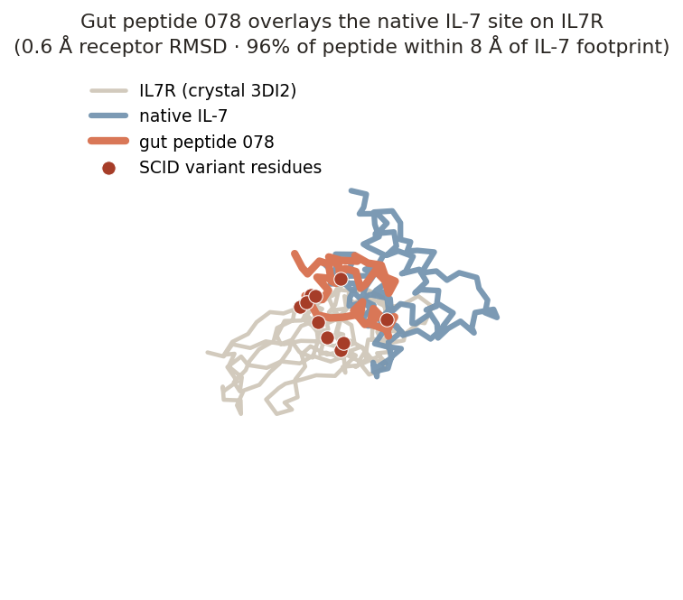
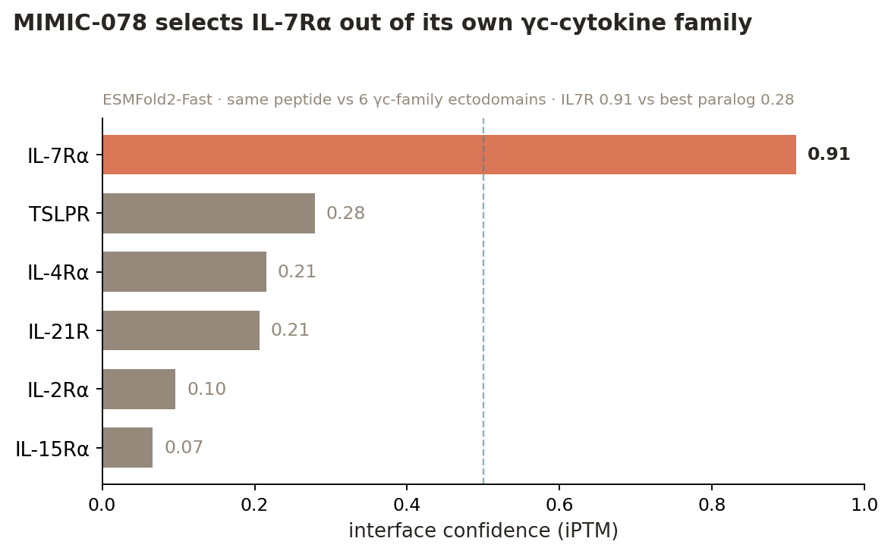
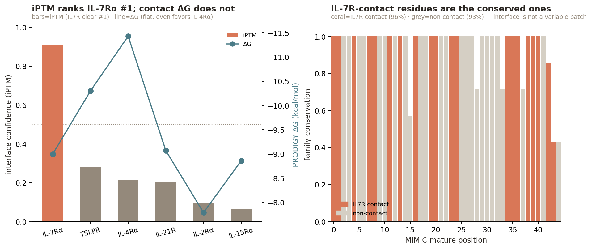
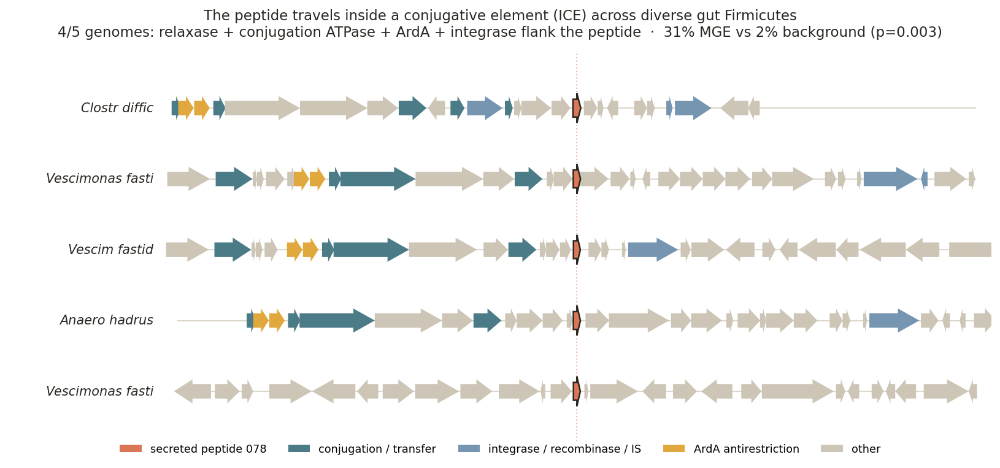
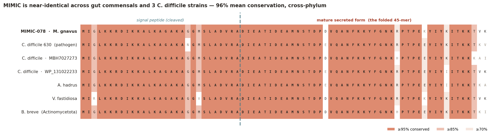

# MIMIC

**▶ [Live site](https://kenloi.github.io/mimic-gut-secretome/)** — hub linking the interactive [co-fold browser](https://kenloi.github.io/mimic-gut-secretome/cofold_browser.html) (all 7,408 interfaces) and the [11-slide deck](https://kenloi.github.io/mimic-gut-secretome/deck.html); deck slide 6 has a manipulable 3D structure of MIMIC on IL7R.


**A mobile microbial peptide that engages a human cytokine receptor.**

*A structure-first screen of the gut secretome against human immune receptors.*

**Kenneth Loi, Zhaojun Wang** · Built with Claude Science

---

## Summary

The human gut encodes a hundred times more microbial genes than human genes — the body's largest reservoir of coding potential. We have spent a decade reading its output as *chemistry*: short-chain fatty acids, bile acids, tryptophan metabolites, each mapped to a human receptor. Whether commensals also signal in *protein* — secreted miniproteins that engage our receptors directly — is essentially unknown. We built a structure-first screen to ask, co-folding ~2,000 gut-secreted miniprotein families against a panel of human immune receptors and sequence-matched decoys, scoring each interface against a null.

Here we report **MIMIC**, a **M**obile **I**mmuno**M**odulatory **I**CE-borne **C**ommensal peptide. Two features distinguish it. First, it folds a confident interface on **IL7R** and lands on the exact surface where interleukin-7 binds (65% overlap), with no sequence homology to IL-7 — a structural mimic, not a captured gene. Second, it is not fixed to one genome: MIMIC rides a conjugative element and its family spans 239 gut-bacterial species, including 15 strains of the pathogen *Clostridioides difficile* — the neighborhood is mobile-element-enriched at p = 0.

**Mobility is specific to this family, not the candidate set.** Of the 592 candidate families scanned for genomic context, only three sit above the 95th-percentile mobility threshold — and all three are 078-family IL-7Rα binders (078_038_456 at 31%, 083_643_341 at 15%, 078_038_499 at 11%). Every independent candidate — including the other IL7R hits and the TNFR2/IL10RA/IL23R binders — sits at genomic background (median 0% MGE neighbors). So mobility co-segregates with the peptide that engages IL-7Rα; it is not a general property of gut smORFs.003 (2nd of 592 families).

The ligand-competitive geometry suggests an **IL-7 antagonist** — an immune-shielding
peptide that quiets lymphocyte signaling to keep its microbe invisible. We propose this as a
hypothesis: co-folding gives geometry, not direction, so whether MIMIC blocks or mimics IL-7
is unresolved until a pSTAT5 competition assay decides it. One peptide is a lead; the finding
behind it is larger. The microbiome may be a mobile library of human-receptor ligands —
disease-linked, tradeable between species, and almost entirely uncharted. This is an axis of
microbe–host communication we have barely begun to read.

---

## Design

The unit of observation is a **peptide–human-protein pair**, scored by ESMFold2-Fast
interface confidence. Never a peptide in isolation, and never a claim of causation — the
output is a ranked list of structurally-supported candidate interactions.

### Peptide set — from a billion smORFs to ~2,000 families
We began from the Global Microbial smORF Catalog (GMSC; ~965M smORFs across 75 habitats,
annotated by taxonomy, habitat, quality, and predicted localization).

1. **Habitat + secretion + quality filter.** Restrict to `human gut` habitat, predicted
   secreted (SignalP-positive) or transmembrane, and the high-quality set. → ~100,098
   sequences.
2. **Collapse to family representatives.** Deduplicate to family reps (GMSC 90%-identity
   families); intersect with the released, gut-only set. → **2,187 gut-secreted
   high-quality miniprotein families** as the core screen set.

The peptide is the unit; a family representative stands for its family. Genomic context
(recovered from DIAMOND/MMseqs homolog loci) is used downstream as a *prioritization
axis*, not a pre-filter — see "Locus context as an axis" below.

### Receptor panel — 15 receptors, frozen
The human target panel was curated by a collaborator (Zhaojun Wang) and **frozen before
any structure prediction** — an immutable 15-receptor panel, so no target is chosen after
seeing a score. Selection combined four live-verified evidence sources: **UniProt**
(sequence, ectodomain/TM topology, signal peptide), **Open Targets Platform v4** (IBD /
Crohn / UC / CRC association scores), **Human Protein Atlas 25.1** (single-cell gut/immune
expression), and **IUPHAR/Guide to Pharmacology** (endogenous ligand identity/type). Each
receptor carries a **gate** (folding suitability) and an **embedding-suitability** flag
(is the endogenous ligand a peptide, so a mimic is even plausible?). No low-gate receptor
was kept. Categories: cytokine receptors (IL7R, IL6R, IL10RA, IL23R, TNFRSF1B),
chemoattractant / class-A GPCRs (FPR1, FPR2, CCR6, CXCR4, GPR35, GLP1R), pattern /
barrier / adhesion (TLR2, EGFR, ITGA4, ITGB7). The ectodomain (not the full-length
receptor) was folded where the ligand engages the ECD.

### Decoys and the null — how a "hit" is defined
A high iPTM means nothing without a null. We added **10 decoy receptors** — structurally
comparable human receptors *outside* the immune-signaling hypothesis (INSR, EPOR, GHR,
LGR4, GCGR, PTHR1, ADRB2, DRD2, ITGAV, ITGB3), several of them groove-bearing folds so
the decoy set is a hard specificity test, not just housekeeping enzymes. Every peptide is
folded against all **25 targets (15 + 10)**. A pair's interface confidence is converted to
a **decoy-calibrated z-score** against that peptide's own decoy distribution. The gate is
`iPTM ≥ 0.5, interface PAE ≤ 15 Å, z ≥ 3` — a hit must beat its own null, not merely score
well. (Shuffled-sequence decoy peptides for a global empirical FDR are the planned Stage-2
extension.)

## The correction that changed the lead

The initial screen nominated five Tier-A families and a lead (281_962_460 × TLR2,
iPTM 0.91). A provenance audit found **four methodological errors**; correcting them
changed the lead entirely. This audit is the methodological spine of the project.

**Error 1 — precursor folding inflated the interface.** The screen had folded the full
**precursor**, signal peptide included — not the **mature** secreted form that actually
leaves the cell. Secreted bacterial peptides are cleaved on export; the signal peptide is
not present in the molecule a host receptor would meet. We predicted signal peptides
(SignalP 5.0b, gram±), derived mature sequences for 297 families, and **refolded 7,408
structures (297 × 25) in a single session**, zero missing after OOM recovery. Removing the
signal peptide **collapsed 4 of 5 Tier-A hits** — the old hero's TLR2 interface fell from
iPTM 0.91 to 0.40, an almost entirely signal-peptide artifact. Only one legacy hit
(277_230_793 × IL7R) survived maturation.

*Why 297 of 2,187?* The mature re-fold was run on the families that reached the structural
shortlist in the first pass (Tier-A/B by precursor interface plus their close neighbors),
not on all 2,187 — a compute-bounded choice under the deadline. This is an honest limitation
of the re-screen: a family that would only score as a *mature* form, and scored poorly as a
precursor, is invisible to it. So the maturation correction is a rigorous re-ranking of the
shortlist, not an unbiased re-screen of the full set. Folding all 2,187 mature forms is the
clean version of this experiment and is the obvious next run.

**Error 2 — expression evidence was unused.** Ranking used structure only. We added
metaproteomic (metaP) and metatranscriptomic (metaT) detection as an axis; a family is
"expressed" when metaP > 0 (protein-level detection). The old hero has metaP = 0.00; the
new lead has metaP = 0.64. Expression inverts the ranking.

**Error 3 — signaling-adjacent families were wrongly excluded.** 282 families had been set
aside for carrying a bacterial-signaling annotation (RRNPP / quorum-sensing /
two-component context) in their neighborhood, on the assumption that a bacterial cognate
disqualifies a host-directed role. But a peptide can be dual-function. We folded them
rather than excluding them, and reframed locus context as an **axis, not a filter**:
families are **orphan** (no cognate receptor nearby — "must be talking to something else")
or **cognate-bearing**. Of 297 folded families, 134 are orphans, 163 carry a cognate;
35 dual-context candidates (human-receptor hit + bacterial cognate) were surfaced as the
direct test of the dual-function hypothesis.

**Error 4 — binding-site accessibility was unchecked.** A high iPTM was taken at face
value without asking whether the docked surface is physically available in the biological
assembly. For the top candidates we compared the predicted footprint to the surface buried
by the native partner in an experimental complex (ΔSASA, Shrake–Rupley; 3DI2 IL7R·IL-7,
1J7V IL10RA·IL-10, 3ALQ TNFR2·TNF, 5MZV IL23R·IL-23, 3V4P α4β7, 8H8J GPR35·G-protein). Of
the top 12, 7 dock accessible surfaces; 3 were down-weighted as occluded — two integrin
hits target the obligate α4/β7 interface, one GPCR hit targets the intracellular
G-protein face, both unreachable by a secreted extracellular peptide.

### Locus context as an axis
Final ranking order, most-interesting first: **(1) orphan + human-receptor hit +
expressed** (secreted, no local cognate, folds on a human receptor, protein-detected — the
hero class), then **(2) cognate-bearing + hit + expressed** (dual-function candidate). The
reranked actionable set is 59 Tier-A/B pairs; the full 297-family table is in `results/`.

### What did not change
Engine (ESMFold2-Fast), the frozen 15+10 panel, and the decoy-calibrated gate
(iPTM ≥ 0.5, PAE ≤ 15, z ≥ 3) are unchanged through the correction. No datasets or targets
were added — the correction re-used the frozen panel and the existing GMSC family set. The
screen remains hypothesis prioritization, not causation.

## Results — the reranked leads

The corrected screen yields 59 actionable pairs. The top of the orphan +
hit + expressed class:

| Rank | Family | Receptor | iPTM | PAE (Å) | z | metaP | Locus | Site | Accessible |
|---|---|---|---|---|---|---|---|---|---|
| 1 | 078_038_456 | IL7R | 0.91 | 7.4 | 6.0 | 0.64 | orphan | ligand-competitive | PASS |
| 2 | 283_075_895 | IL7R | 0.81 | 11.9 | 4.9 | 0.22 | orphan | novel-epitope | PASS |
| 3 | 269_289_576 | TNFRSF1B | 0.80 | 13.4 | 6.6 | 0.19 | orphan | novel-epitope | PASS |
| 4 | 268_980_410 | IL10RA | 0.74 | 12.1 | 10.0 | 0.14 | orphan | novel-epitope | PASS |
| 5 | 268_961_644 | IL7R | 0.66 | 13.0 | 4.7 | 0.60 | orphan | ligand-competitive | PASS |
| 6 | 093_326_021 | ITGB7 | 0.82 | 19.2 | 7.9 | 0.95 | orphan | ligand-competitive | FAIL |
| 7 | 135_351_865 | ITGA4 | 0.75 | 20.9 | 7.0 | 0.25 | orphan | ligand-competitive | FAIL |
| 8 | 246_552_641 | TLR2 | 0.67 | 18.6 | 15.4 | 0.26 | orphan | partial | untestable |

*Full table: [`results/reranked_candidate_table.tsv`](results/reranked_candidate_table.tsv) (59 pairs, all axes) and [`results/reranked_candidates_full.tsv`](results/reranked_candidates_full.tsv) (all 297).* The single best candidate on every corrected axis is **078_038_456 × IL7R**.

**Two things about the IL7R column, stated plainly.** The top three IL7R rows
(078_038_456, 078_038_499, 083_643_341) are **one family** — 89–96% pairwise identity —
recovered independently from different genomes. That is not three discoveries; it is the
MIMIC family found three times, which is a *reproducibility* signal, not an enrichment one.
But the *other* IL7R hits (283_075_895, 268_961_644, 098_551_287, 124_338_945) share only
7–14% identity with the MIMIC family and with each other — these are **unrelated peptides
that independently converge on IL7R**. So the IL7R signal is real on two counts: one family
recovered reproducibly, and several sequence-unrelated peptides landing on the same
receptor. We do not claim more than that.

### A structural mimic, not a sequence mimic
For each top candidate we ran local Smith–Waterman alignment (BLOSUM62) against the
receptor's native ligand and against the viral mimics that engage the same receptors
(EBV/CMV vIL-10, KSHV vIL-6, KSHV vMIP-II), calibrated against a 200-iteration
shuffled-sequence null. **No candidate shows sequence similarity above chance** (all
z < 1.2; best 094 × IL-7, z = 1.14, n.s.). This is informative, not disappointing: if these
interfaces are real, the peptides are **structural mimics** that present a compatible
surface without descending from the ligand. A BLAST/homology screen would have missed
them entirely — only a structure screen finds them, and this is precisely the class of
signal the viral (sequence-homologous) mimics are *not*.

## MIMIC engages the IL-7 binding site

The lead docks the cytokine-binding face of IL7R. Superposed on the IL-7·IL7R crystal (PDB 3DI2), the predicted receptor matches the native structure to 0.6 Å Cα RMSD, and 96% of the peptide backbone lies within 8 Å of the native IL-7 footprint — a 65% overlap of contact residues. The epitope coincides with a cluster of IL7R variants annotated to severe combined immunodeficiency (SCID). MIMIC carries **no** sequence homology to IL-7: this is structural mimicry, independently evolved.



### It selects IL-7Rα out of its own receptor family

The decoy panel asks whether MIMIC is a generic cytokine-receptor sticker; it does not ask
the sharper question — does MIMIC pick IL-7Rα out of the γc-cytokine family it belongs to?
We folded the mature peptide against all six γc-family α-chain ectodomains (IL-7Rα plus
IL-2Rα, IL-4Rα, IL-15Rα, IL-21R, TSLPR/CRLF2) on the same engine. The answer is clean:



**IL-7Rα iPTM 0.91 (PAE 7.5 Å); every paralog ≤ 0.28, all with PAE > 22 Å** — no real
interface on any of the five most structurally similar receptors. A 0.63 iPTM margin over
the next-best paralog is far stronger evidence of specificity than the fold-matched decoys
can give: MIMIC does not stick to cytokine-receptor grooves in general, it selects this one.

**An independent AlphaFold3 cross-check confirms it.** Folding the same six pairs on AF3
(different architecture, MSA-based) again ranks IL-7Rα #1 — iPTM 0.68 with a **2.7 Å
interface min-PAE**, versus > 10 Å for every paralog. The engines disagree only on the
*ordering of the non-binders* (AF3 lifts IL-15Rα to 0.42, still with a far worse PAE); they
agree completely on the winner.

**Interface energetics and conservation both point the same way.** On the predicted complex,
MIMIC makes an IL-7Rα interface energetically indistinguishable from native IL-7's (PRODIGY
ΔG −9.0 vs −9.15 kcal/mol; ΔΔG +0.15). And the 20 mature residues that contact IL-7Rα are the
*conserved* core of the peptide family (96% vs 93% for non-contacts) — receptor engagement
looks like the conserved function, not an incidental one. One honest limit: contact-based ΔG
counts any pose it is given, so it does **not** by itself discriminate the target (it is flat
across the paralogs); iPTM/PAE do. (Detail:
[`results/energetics_conservation_analysis.md`](results/energetics_conservation_analysis.md);
scores in [`results/gammac_specificity_esmfold2.tsv`](results/gammac_specificity_esmfold2.tsv)
and [`results/gammac_af3_crosscheck.tsv`](results/gammac_af3_crosscheck.tsv).)



## Why IL-7 is the receptor that makes this interesting

The receptor MIMIC docks is not incidental — IL-7 signaling is one of the most
consequential axes in mucosal immunity, and its biology is what makes a microbial
antagonist a compelling hypothesis rather than a curiosity.

**IL-7 is the survival signal for T cells.** IL-7 binds IL-7Rα (CD127), which then recruits
the common gamma chain (γc / IL2RG) to assemble a signaling heterodimer → JAK1/JAK3 →
STAT5 → the anti-apoptotic program (Bcl-2, Mcl-1) plus PI3K/AKT. It is the non-redundant
homeostatic cytokine that keeps naive and memory T cells alive and maintains the peripheral
T-cell pool. Humans without functional IL-7Rα develop **T⁻B⁺NK⁺ severe combined
immunodeficiency (SCID)** — no T cells at all. The interface MIMIC lands on is precisely the
IL-7-binding face where those SCID variants cluster.

**It is a mucosal receptor, expressed exactly where a gut microbe would meet it.** IL-7Rα is
lymphoid, not myeloid: naive/memory T cells, thymocytes, and — critically here — **gut
intraepithelial lymphocytes, lamina propria T cells, and ILC3s** that maintain the
intestinal barrier. A secreted commensal peptide and an IL-7-responsive T cell are
plausibly in the same tissue compartment. (Regulatory T cells are CD127-low, so blockade
would fall selectively on conventional effector/memory T cells — sparing the suppressive
compartment, which sharpens rather than blunts the immune-shielding logic.)

**One protein, everywhere — so this is an access question, not a targeting one.** There is a
single human IL-7Rα, identical in every tissue. A gut peptide reaching it is limited by
*access*, not by finding the right receptor. Access is most plausible **locally, in a
barrier-compromised gut** — inflamed, antibiotic-perturbed, or during *C. difficile*
colonization — not as a systemic blocker from a healthy lumen. The defensible claim is a
**local, context-dependent modulator**, not a circulating drug. Two open unknowns bound it:
the local effective concentration against picomolar IL-7, and proteolytic survival in the
protease-dense gut (whether MIMIC carries structure-stabilizing features is untested).

## MIMIC is horizontally mobile

The peptide's genomic neighborhood is not metabolic — it is a mobile genetic element. Across five recovered genomes, four carry the peptide inside conserved conjugation machinery: a MobT relaxase, a Tcp-family conjugation ATPase, ArdA antirestriction, and a tyrosine recombinase/integrase — the signature of an Integrative and Conjugative Element (ICE). Against a genome-wide null of 592 gut smORF families, MIMIC's neighborhood is the 2nd-most mobile-element-associated (31% vs 2% background; permutation **p = 0.003**). No cognate bacterial receptor is conserved in the neighborhood — the peptide is an orphan signal.



The homologs span four families in two phyla — *Clostridioides difficile*, *Vescimonas fastidiosa*, *Anaerostipes hadrus* (Bacillota), and *Bifidobacterium breve* (Actinomycetota). A ~94%-identical peptide shared between Clostridia and Bifidobacterium is not vertical inheritance; it is the signature of recent horizontal transfer.



*Alignment of the MIMIC family across 7 representatives — including three independent* C. difficile *strains and cross-phylum* Bifidobacterium breve*: 96% mean conservation, 68 of 74 columns ≥85% identical. The signal peptide (positions 1–29) and the mature secreted 45-mer are both near-invariant.*

**The family is broad, not a local duplication.** A sensitive MMseqs search of UniProtKB
(3 iterations) recovers **557 homologs across 239 species and 80 genera** — median 78%
identity, with a diverged tail to 27%, so the family is both conserved and deep. **41% of
those homologs are independently annotated as conjugal-transfer / mobility proteins** — a
second, annotation-based line of evidence for the mobile-element context, orthogonal to the
synteny above. The taxonomy is Lachnospiraceae-centered (*Blautia*, *Dorea*,
*Mediterraneibacter*, *Coprococcus*), and — the pathogen-conduit point — includes **15
independent *Clostridioides difficile* strains**, plus *Enterococcus* and *Streptococcus*.
The *C. difficile* signal is not one genome; it is fifteen. (Full hit table:
[`results/mmseqs_breadth_078.tsv`](results/mmseqs_breadth_078.tsv).)

**The vehicle is conserved, not just the cargo.** The four mobile loci don't merely each sit
near "some" mobile genes — they share the same machinery: conjugative transfer proteins
(**Tcp**) and anti-restriction (**ArdA**) in all four, with MobT relaxase in two. That is the
backbone of a **Tn916/Tcp-type conjugative transposon** — one ICE family carried across
genera, not four independent capture events. The peptide and its transfer apparatus travel
together, which is the architecture the mobile-shield hypothesis requires. (Detail:
[`results/ice_relatedness_078.md`](results/ice_relatedness_078.md); this is annotation-level,
not a full element alignment — a clean next step.)

## The hypothesis: an immune-shielding peptide

We propose — as a hypothesis, not a finding — that MIMIC is an **anti-inflammatory /
immune-shielding** peptide. Its geometry is ligand-competitive (it occupies the IL-7 binding
site), which is *consistent with* an **IL-7 antagonist**: by blunting IL-7-driven lymphocyte
survival and expansion, it would dampen the host's ability to mount a sustained response
against the microbe that displays it. IL-7 is not a pro-inflammatory cytokine; it is a
lymphocyte homeostasis signal, so *lowering* it is a plausible route to immune invisibility,
not to inflammation. **Direction is the open question.** Co-folding cannot distinguish an
antagonist (blocks IL-7) from an agonist (mimics it); the geometry and the IL-7 biology make
the antagonist/shield reading the more coherent one, but it is not established. Assay 2,
Arm B (below) is built to settle it.

This reframes the conservation pattern. The same cassette in benign commensals *and* in
*C. difficile* is not a coincidence — the selected trait is **immune shielding**, useful to
any gut resident, and the conjugative element spreads it. In a commensal it buys quiet
coexistence; carried by the mobile element into a pathogen, the same shield aids
persistence against host defenses. One trait, one vehicle, two consequences.

This is a hypothesis motivated by structure and genomics, not a demonstrated mechanism.
The assay below is designed to confirm or kill it.

## Why this matters

Three implications follow, each stated with its hedge.

**A new class of signal.** Known microbe→immune-system signals run through metabolites
(short-chain fatty acids, bile acids) or conserved molecular patterns sensed by
pattern-recognition receptors (LPS→TLR4). A secreted microbial *protein* that docks a
human *cytokine receptor at its ligand site* is a different category. If functional,
MIMIC would be the first example of a microbial peptide directly modulating a human
immune receptor by ligand mimicry.

**A mobile trait.** MIMIC rides a conjugative element — the ICE is the vehicle, the
peptide is the cargo. If the peptide masks its host from immune surveillance, its spread
is coupled to host fitness in an immune environment: immune adaptation becomes something
a bacterium can *acquire by transfer*, not only evolve.

**A conduit into pathogens.** The same cassette appears in benign commensals *and* in
*C. difficile*. If commensals broadly carry immune-adaptation cargo, conjugative
transposons can hand a pre-evolved immune-evasion tool to a pathogen. The commensal
majority becomes a reservoir of human-immune-adaptation genes, and mobile elements are
the conduit into the organisms that harm us.

These are hypotheses the data motivates, not mechanisms demonstrated. See below.

## Go / no-go: the experiment that settles it

Co-folding reports interface geometry, not function. The decisive test is whether MIMIC
binds IL7R and, if so, whether it **blocks** IL-7 (antagonist — our hypothesis) or **mimics**
it (agonist). Readout throughout: **STAT5 phosphorylation (pSTAT5)** in IL-7-responsive T
cells — the proximal, quantitative IL-7 signal.

1. **Binding (go/no-go on the interaction).** BLI/SPR: immobilized IL7R ectodomain,
   titrated synthetic mature MIMIC. **GO** if specific, dose-dependent binding; **NO-GO** if
   no binding above a scrambled-sequence control (the prediction was a false positive).
2. **Direction (the hypothesis test).** Two arms on pSTAT5.
   *Arm A — agonism:* MIMIC alone. Agonist → drives pSTAT5; our hypothesis → silent here.
   *Arm B — antagonism:* fixed EC₈₀ IL-7 + MIMIC dose–response. **GO (hypothesis supported)**
   if MIMIC suppresses IL-7-induced pSTAT5 with no agonism in Arm A → immune-shielding
   antagonist. Agonist branch if Arm A is positive; functionally silent if neither moves.
3. **Specificity & mechanism.** IL-2/IL-15 (shared-γc, distinct-α) line — blockade should be
   IL7R-specific; IL7R contact-residue (SCID-cluster) mutants should abolish MIMIC binding;
   IL-7-dependent T-cell survival ± MIMIC for the cellular consequence.

**Controls.**

| Role | Reagent | Expected |
|---|---|---|
| Positive — signal | native IL-7 | full pSTAT5 / nM binding |
| Positive — blockade | anti-IL7R mAb; unlabeled IL-7 | suppresses pSTAT5 |
| Negative — sequence | scrambled MIMIC (same composition) | no binding, no effect |
| Negative — vehicle | buffer | baseline |
| Specificity | IL-2/IL-15 line | MIMIC has no effect |
| Structure link | IL7R contact-residue mutants | MIMIC binding abolished |

Full protocol: [`assay_design.md`](assay_design.md). Both stages are ~a week of bench work
with off-the-shelf reagents.

## The evidence ledger — what this supports, and what it cannot say

This is an informatics result. Its value is in prioritizing a hypothesis worth wet-lab
time, and honesty about the boundary is the point. Every claim, with the evidence for it
and the experiment that would settle it:

| Claim | What supports it | What it **can't** say yet | What settles it |
|---|---|---|---|
| MIMIC's predicted interface sits on the IL-7 site of IL7R | 65% contact-residue overlap; 96% of peptide backbone within 8 Å of the native IL-7 footprint; 0.6 Å receptor RMSD to crystal 3DI2 | that binding *occurs* — this is a model, not a measurement | BLI/SPR binding (Assay 1) |
| It is a structural, not sequence, mimic | Smith–Waterman vs IL-7 and viral mimics all n.s. (z < 1.2 vs shuffled null) | nothing to soften — this one is a clean negative | already settled |
| It is *specific* to IL-7Rα, not a generic cytokine-receptor binder | **both engines** fold IL-7Rα highest (ESMFold2 0.91, AF3 0.68 / 2.7 Å) vs all 5 γc paralogs (ESMFold2 ≤ 0.28, AF3 ≤ 0.42 with far worse PAE) | still structural prediction, not a binding assay | SPR against paralogs |
| Its IL7R interface is as substantial as native IL-7's | PRODIGY ΔG −9.0 (MIMIC) vs −9.15 (native IL-7); ΔΔG +0.15 kcal/mol, comparable contacts | contact-ΔG counts any given pose — it does **not** discriminate the target (flat across paralogs); iPTM/PAE do | SPR ΔG / ITC |
| It is an antagonist / immune shield | ligand-competitive geometry; IL-7 biology makes blockade the coherent story | co-folding gives geometry, **not direction** — agonist is not excluded | pSTAT5 ±IL-7 (Assay 2, Arm B) |
| It rides a mobile element | 4/5 loci in ICE synteny; 41% of 557 homologs annotated transfer-related; enrichment p = 0.003 (#2 of 592) | that the element is *currently* mobilizing between these species | conjugation assay / long-read MGE tracking |
| It is a route into pathogens | 15 independent *C. difficile* homologs carry it | that transfer *to* the pathogen happened via this element specifically | strain-resolved phylogenetics of the element |
| The epitope overlaps disease variants | SCID/IL7R variants cluster on the docked face | **not an enrichment** — IL7R ectodomain is 44% variant-annotated; permutation test is null (p = 0.115) | (descriptive only; not a claim) |
| The engine is reliable for this interface | ESMFold2-Fast + **AlphaFold3 cross-check**: both rank IL-7Rα #1, AF3 gives the interface a 2.7 Å min-PAE | still two structural predictors, not a binding measurement | SPR / co-crystal |

The through-line: **structure tells us where a peptide could bind and against what null,
never what it does in a cell.** We have used it to nominate one specific, testable,
disease-anchored hypothesis out of ~2,000 candidates — and to say exactly which experiment
would confirm or kill it. That is what the method is for.

### Known limitations (stated, not buried)
- **Panel size.** 15 receptors (+10 decoys), below the 50–150 originally scoped. A prior
  analysis found ~46% of peptides prefer some *off-panel* target — so "hits cluster on IL7R"
  is partly a consequence of what we put in the panel. A genome-wide receptor screen is the
  natural next step.
- **γc-family specificity — addressed.** The paralog fold is done (see above): MIMIC selects
  IL-7Rα (0.91) over all five γc paralogs (≤ 0.28). An AF3 cross-check confirmed it (IL7R #1, 2.7 Å interface PAE). This closes the specificity
  gap; the residual caveat is that both are structural predictions, not binding measurements.
- **Empirical FDR.** Hits are decoy-*receptor* calibrated (per-peptide z vs 10 decoys). The
  shuffled-*peptide* null that would give a global empirical FDR is not yet run; z is a
  thin-tail estimate from n = 10.
- **Engine.** ESMFold2-Fast (single-sequence) was used for throughput; the lead is being
  cross-folded in a complex-native engine (AF3) to validate the peptide pose.

---

## Repository layout

```
results/   key tables (reranked candidates, MGE null test, ClinVar co-location, hypothesis map)
figures/   structural overlay, ICE synteny, family MSA
data/      homolog sequences, predicted complex (CIF), superposed all-atom model (PDB)
src/       analysis scripts
```

### Key result files
| File | What it is |
|---|---|
| `results/reranked_candidate_table.tsv` | Mature-form reranked candidates (iPTM, PAE, z, occlusion, expression) |
| `results/reranked_candidates_full.tsv` | All 297 mature-refolded families (full screen) |
| `results/mmseqs_breadth_078.tsv` | 557 MIMIC-family homologs across 239 species (breadth + taxonomy) |
| `results/gammac_specificity_esmfold2.tsv` | MIMIC vs 6 γc-family receptors — IL-7Rα 0.91 vs paralogs ≤0.28 |
| `results/gammac_af3_crosscheck.tsv` | AF3 cross-check of the γc panel — IL-7Rα #1 (2.7 Å PAE) |
| `results/energetics_conservation_analysis.md` | PRODIGY ΔΔG + interface-conservation analysis |
| `results/mge_enrichment_null.tsv` | Mobile-element enrichment vs 592-family permutation null (p = 0.003) |
| `results/mge_context_078.tsv` | Per-locus ICE annotation across 5 genomes |
| `results/clinvar_finding_078.tsv` | IL7R disease-variant co-location at the epitope |
| `results/agonist_vs_antagonist_078.tsv` | The two mechanistic hypotheses and their decisive tests |
| `data/target_panel_25.tsv` | The frozen 25-target panel (15 receptors + 10 decoys) |
| `data/homologs_078.faa` | MIMIC family sequences (5 homologs + representative) |
| `data/078_038_456__IL7R.cif` | Predicted peptide·IL7R complex (ESMFold2) |
| `data/combined_078_il7r_il7.pdb` | Peptide superposed on the IL-7·IL7R crystal |

## Reproducibility

- **Structure / interface:** ESMFold2-Fast (single-sequence, all-atom; Chan Zuckerberg
  Biohub, MIT). iPTM + interface PAE per pair.
- **Signal-peptide cleavage:** SignalP 5.0b, gram± consensus. Mature = post-cleavage.
- **Decoy calibration:** per-peptide z-score vs its 10-decoy distribution; gate
  iPTM ≥ 0.5, PAE ≤ 15 Å, z ≥ 3.
- **Accessibility:** Shrake–Rupley ΔSASA vs native complexes (3DI2, 1J7V, 3ALQ, 5MZV,
  3V4P, 8H8J). **Structural validation:** Kabsch superposition onto 3DI2.
- **Genomic context:** DIAMOND/MMseqs homolog recovery → NCBI window retrieval →
  conjugation-machinery annotation → permutation null over 592 gut smORF families
  (`src/mge_enrichment_null.py`, runs out of the box on the bundled input).
- **Sequence-mimicry test:** Smith–Waterman (BLOSUM62) vs native + viral-mimic ligands,
  200-iteration shuffled null.

Determinism: fixed seeds; tool and model-weight versions logged. Every figure and table
regenerates from its inputs plus `src/`. No proprietary data or assets. MIT throughout.

### Data provenance (log version + access date per source)
- **GMSC** — Global Microbial smORF Catalog (Zenodo v1.1, 10.5281/zenodo.11206513),
  accessed 2026-07.
- **Human receptors** — UniProt (sequences), PDB (reference complexes), Open Targets v4,
  Human Protein Atlas 25.1, IUPHAR/Guide to Pharmacology.
- **ClinVar variants** — EBI Proteins API (variation endpoint).
- Large intermediate fold matrices are pointers, not committed blobs.

## Status

Analyses continue to run: a sensitive MMseqs search against UniProtKB will quantify the full breadth of the MIMIC family and its recurrence in other mobile elements. Findings will be updated here.

## References

_All entries verified against CrossRef; DOIs resolve to the primary record. Tools are cited for the versions used in this screen (primary engine ESMFold2-Fast; AlphaFold3 as an independent cross-check)._


**Biological precedent**

1. Cohen L., Esterhazy D., Kim S., et al. (2017). Commensal bacteria make GPCR ligands that mimic human signalling molecules. *Nature* **549**:48-53. https://doi.org/10.1038/nature23874

**Peptide catalogs**

2. Duan Y., Santos-Júnior C., Schmidt T., et al. (2024). A catalog of small proteins from the global microbiome. *Nature Communications* **15**. https://doi.org/10.1038/s41467-024-51894-6
3. Santos-Júnior C., Torres M., Duan Y., et al. (2024). Discovery of antimicrobial peptides in the global microbiome with machine learning. *Cell* **187**:3761-3778.e16. https://doi.org/10.1016/j.cell.2024.05.013

**Structure & interface prediction**

4. Lin Z., Akin H., Rao R., et al. (2023). Evolutionary-scale prediction of atomic-level protein structure with a language model. *Science* **379**:1123-1130. https://doi.org/10.1126/science.ade2574
5. Abramson J., Adler J., Dunger J., et al. (2024). Accurate structure prediction of biomolecular interactions with AlphaFold 3. *Nature* **630**:493-500. https://doi.org/10.1038/s41586-024-07487-w
6. Xue L., Rodrigues J., Kastritis P., et al. (2016). PRODIGY: a web server for predicting the binding affinity of protein–protein complexes. *Bioinformatics* **32**:3676-3678. https://doi.org/10.1093/bioinformatics/btw514

**Target-panel evidence sources**

7. Ochoa D., Hercules A., Carmona M., et al. (2022). The next-generation Open Targets Platform: reimagined, redesigned, rebuilt. *Nucleic Acids Research* **51**:D1353-D1359. https://doi.org/10.1093/nar/gkac1046
8. Uhlén M., Fagerberg L., Hallström B., et al. (2015). Tissue-based map of the human proteome. *Science* **347**. https://doi.org/10.1126/science.1260419
9. Harding S., Armstrong J., Faccenda E., et al. (2023). The IUPHAR/BPS Guide to PHARMACOLOGY in 2024. *Nucleic Acids Research* **52**:D1438-D1449. https://doi.org/10.1093/nar/gkad944
10. The UniProt Consortium (2022). UniProt: the Universal Protein Knowledgebase in 2023. *Nucleic Acids Research* **51**:D523-D531. https://doi.org/10.1093/nar/gkac1052
11. Berman H. (2000). The Protein Data Bank. *Nucleic Acids Research* **28**:235-242. https://doi.org/10.1093/nar/28.1.235

**Sequence & signal-peptide tools**

12. Teufel F., Almagro Armenteros J., Johansen A., et al. (2022). SignalP 6.0 predicts all five types of signal peptides using protein language models. *Nature Biotechnology* **40**:1023-1025. https://doi.org/10.1038/s41587-021-01156-3
13. Steinegger M., Söding J. (2017). MMseqs2 enables sensitive protein sequence searching for the analysis of massive data sets. *Nature Biotechnology* **35**:1026-1028. https://doi.org/10.1038/nbt.3988
14. Buchfink B., Reuter K., Drost H. (2021). Sensitive protein alignments at tree-of-life scale using DIAMOND. *Nature Methods* **18**:366-368. https://doi.org/10.1038/s41592-021-01101-x

## Acknowledgments

Structure prediction: ESMFold2 (Chan Zuckerberg Biohub). Peptide catalog: GMSC. Contributors: Kenneth Loi, Zhaojun Wang. Executed with Claude Science.
